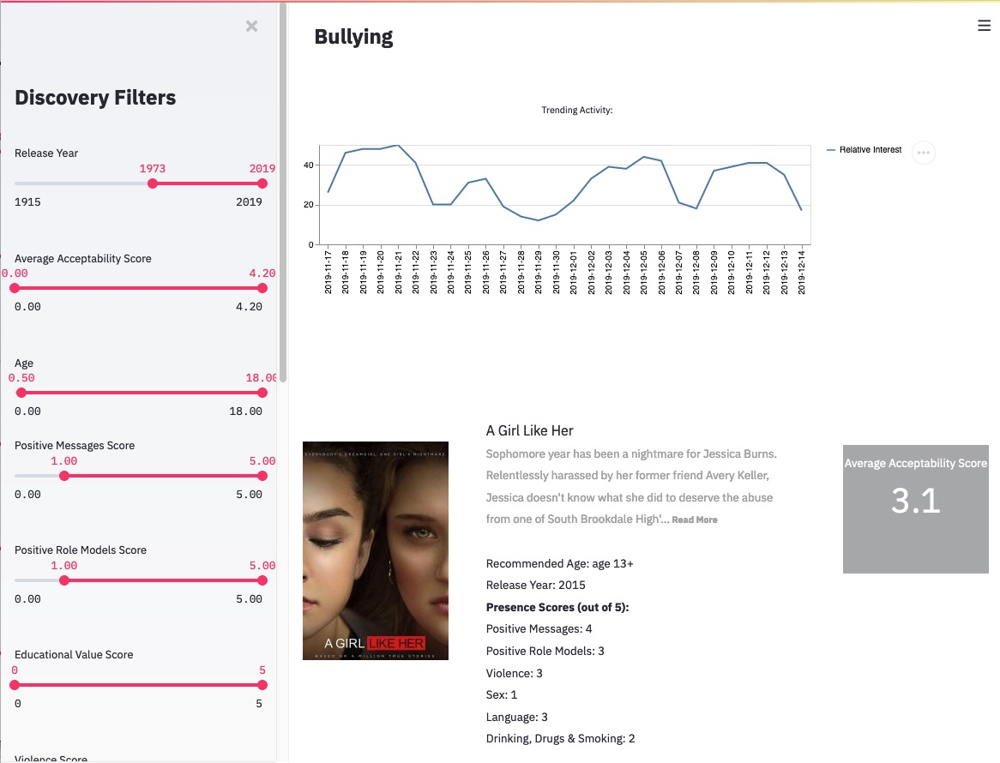
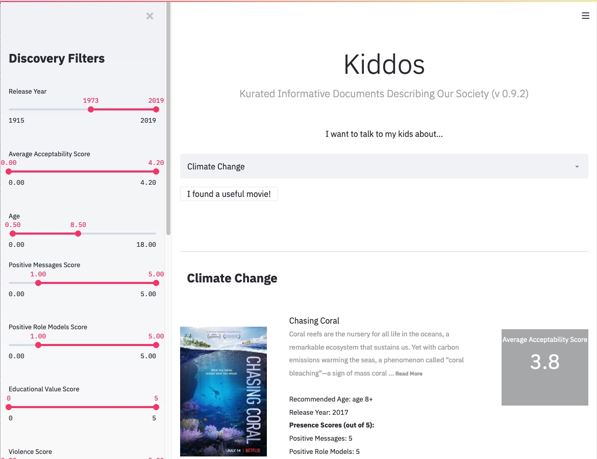

Kiddos
######

*Kurated Informative Documents Describing Our Society*

A project to help parents, children, and social explorers to discover content by impactful filters.  

* `Background`_
* `Technology`_
* `Future`_
* `Team`_

Background
==========
This project was created to help parents engage on social issues with their children through 
ingelligence, guided content choices (see.  This application follows the spirit of guided pruning 
and curated list generation and attempts to avoid the `"content choice paradox" <https://medium.com/8px-magazine/netflix-and-the-constant-struggle-of-making-choices-dfbd6f240d64>`_.

* *trends* It provides a trending topic view for those individuals who may not know where to 
  start, or want to see what the most recent web search (or other viewership activity) may be
  (see `Trending Example`_).
* *social topics* Extracted from online discussion forums and modern social-good sources have 
  been included as starter topics (see `Filtering Example`_).
* *presence scores* Sourced from content partner `Common Sense Media <https://www.commonsensemedia.org/>`_,
  these scores help to understand the impact and intensity of sub-topics within the media.

.. _Trending Example:

    Kiddos interface with some filters and trend line rendered.

Technology
==========
This application combines a number of technologies to present this transformed data experience.

* `NLP <https://en.wikipedia.org/wiki/Natural_language_processing>`_ to map from social issues 
  to content of movies; from an initial phrase or paragraph, find 
  the similarity among embedded items.  
* Interactive filtering from a new library called `Streamli.io <https://streamlit.io/docs/api.html>`_
  that helps to quickly build an insights app.  Other tools like `Dash <https://plot.ly/dash/>`_ are also
  acknowledged but were not used in this instance.
* Scraping using common scraping tools and data parsers like `BeautifulSoup <https://www.crummy.com/software/BeautifulSoup/>`_
  to extract key items for use as metadata.
* Back-end linkage to `IMDB <https://www.imdb.com/>`_ for additional metadata description, such as
  production notes, trivia, and other intersting content information.  At writing, this information
  is not currently used.
* Indication of streaming and previews via `Watchnow <https://watchnow.com/>`_ to provide actionable 
  links for users to jump into an asset. 

Interested in running it yourself? Just install streamlit and then run the app from its directory...

.. code-block:: 

    pip install streamlit
    cd app; streamlit run kiddos.py

    

Adding Score Data
-----------------
The app uses columnar score data in individual CSVs to make editing easier.  If you want to fill or 
replace one of the existing categories, check out the directory `data/score_data` in this repo and
*only if it's a new file* follow these simple directions to get it added to git/lfs.

.. code-block:: 

    git lfs track data/score_data/NEWFILE.csv
    git add data/score_data/NEWFILE.csv -f

Future
======
Future directions for ML, business, and user-focused expansions that just didn't fit into
a single day's hack.

* Machine-learned Models
   * **Presence Models**: Based on scores from `Common Sense Media`, train models for
     text and other content to create classifiers for un-labeled assets (e.g. from `IMDB` or
     new content sources).
   * **Segment Classifiers**: Further, combine machine learned models with content segments
     to classify smaller parts of video for recognition and presence score modeling.   
* Business examples
   * **Engagement**: Finding the impact and meaningfulness of different social issues versus 
     engagement;  here, we can link the data with sources that indicate viewership or financial 
     gross for attendance
   * **Forecasting**: Utilizing metadata, can one forecast which types of movies would be most
     interesting or useful to produce? What if the trending analysis of key topics is also 
     considered?
* User Examples
   * **Catalog Suggest**: Go beyond what's on our catalog, but allow users to suggest that 
     it's added to the catalog.
   * **Freform Problem Search**: Using the questions created by `Common Sense Media`, allow parents
     to enter free from text and match against those phrases to provide potential content
     to help answer those questions.
   * **Actor and Production Sourcing**: Have a `favorite actor <https://www.commonsensemedia.org/search/Kristen%20Bell>`_
     content company, or other metadata entry?  Either in the existing interface or something
     with a new twist, give additional entries into the data.
   * **Additional Visualizations**: Reduce some of the text-heavy reporting to some thing with
     additional graphs.

.. _Filtering Example:

    Kiddos interface with specific topic and filters activated

Team
====
This team of collaborators spans locations and internal companies. 

* **Jianxiong Dong** - Like to develop scalable data mining tools and build customer-focused 
  machine learning applications    (Principal Inventive Scientist, 
  Data Science and AI Research, AT&T, San Ramon, CA)
* **Sam Lee** - Sam Lee - Loves dogs and video games. Sell-Side and Marketplace 
  Data Science. (Data Scientist, Data Science, Xandr, San Ramon, CA)
* **Ashutosh Sanzgiri** - Content & Contextual Intelligence (Senior Data Scientist, 
  Xandr, Portland, WA)
* **Eric Zavesky** - Video analytics and machine learning veteran with a user-centric focus.  
  Seeking to use automation and guidance to solve problems in content, XR, IoT and robtics.  
  (Principal Inventive Scientist, Data Science and AI Research, AT&T, Austin, TX)

